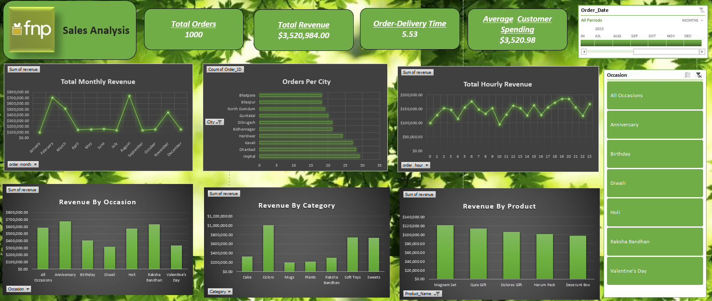

# Ferns and Petals — Sales Analysis Dashboard

### An end-to-end data analytics project uncovering sales trends, customer behavior, and product performance for India's leading gifting platform.

---

## Project Overview

**Ferns and Petals (FNP)** is one of India's most recognized gifting brands, delivering flowers, cakes, sweets, soft toys, and custom gift hampers for occasions like Diwali, Raksha Bandhan, Holi, Valentine's Day, Birthdays, and Anniversaries.

This project performs a comprehensive sales analysis on FNP's 2023 transaction data to answer 10 core business questions:

| # | Business Question |
|---|---|
| 1 | What is the total revenue generated? |
| 2 | What is the average order-to-delivery time? |
| 3 | How do sales fluctuate across months? |
| 4 | Which products are the top revenue generators? |
| 5 | How much are customers spending on average? |
| 6 | What is the sales performance of the top 5 products? |
| 7 | Which cities place the highest number of orders? |
| 8 | Does order quantity impact delivery time? |
| 9 | How does revenue compare across occasions? |
| 10 | Which products are most popular by occasion? |

---

## Dataset Description

**File:** `fnp_sales.xlsx`

The workbook contains the following sheets:

| Sheet | Rows | Columns | Description |
|---|---|---|---|
| `orders` | 1,000 | 18 | Order transactions with dates, revenue, quantity, location, and occasion |
| `products` | 70 | 6 | Product catalog with category, price, and occasion mapping |
| `customers` | 100 | 7 | Customer profiles including name, city, gender, and contact info |
| `pivot tables` | — | — | Pre-built pivot summaries powering dashboard charts |
| `Dashboard` | — | — | Interactive Excel dashboard with slicers and charts |

**Key Fields:**

```
Orders    → Order_ID, Customer_ID, Product_ID, Quantity, Order_Date,
            Delivery_Date, Location, Occasion, Revenue, date diff
Products  → Product_ID, Product_Name, Category, Price (INR), Occasion
Customers → Customer_ID, Name, City, Gender, Email
```

**Scope:** 1,000 orders · 70 products · 100 customers · 301 cities · Full Year 2023

---

## Key Performance Indicators

| Total Orders | Total Revenue | Avg. Delivery Time | Avg. Customer Spend |
|:---:|:---:|:---:|:---:|
| **1,000** | **Rs. 35,20,984** | **5.53 days** | **Rs. 3,520.98** |

| Unique Products | Cities Served | Unique Customers | Avg. Product Price |
|:---:|:---:|:---:|:---:|
| **70** | **301** | **100** | **Rs. 1,129.84** |

---

## Dashboard Preview

> Built entirely in **Microsoft Excel** with dynamic slicers, pivot charts, and KPI cards.



**Dashboard Components:**

| Visual | Type | Description |
|---|---|---|
| Total Monthly Revenue | Line Chart | Revenue trend across all 12 months of 2023 |
| Orders Per City | Horizontal Bar | Top cities ranked by order volume |
| Total Hourly Revenue | Line Chart | Revenue distribution across 24 hours |
| Revenue by Occasion | Bar Chart | Revenue comparison across all 7 gift occasions |
| Revenue by Category | Bar Chart | Category-level revenue breakdown |
| Revenue by Product | Bar Chart | Top product revenue rankings |
| KPI Cards | Metric Tiles | Total Orders, Revenue, Delivery Time, Avg Spend |
| Slicers | Filters | Dynamic filtering by Occasion and Order Date |

---

## Business Insights

### 1. Monthly Sales Performance

| Month | Revenue (Rs.) | Trend |
|---|---|---|
| January | 95,468 | Low |
| **February** | **7,04,509** | Peak — Valentine's Day |
| March | 5,11,823 | High — Holi |
| April | 1,40,393 | Moderate |
| May | 1,50,346 | Moderate |
| June | 1,57,913 | Moderate |
| July | 1,35,826 | Low |
| **August** | **7,37,389** | Peak — Raksha Bandhan |
| September | 1,36,938 | Low |
| October | 1,51,619 | Moderate |
| November | 4,49,169 | High — Diwali |
| December | 1,49,591 | Moderate |

> **Insight:** Revenue is highly seasonal. **August** and **February** are the standout peaks driven by Raksha Bandhan and Valentine's Day respectively. January, July, and September are trough months — ideal windows for running promotional campaigns to smooth out revenue dips.

---

### 2. Revenue by Occasion

| Rank | Occasion | Revenue (Rs.) | Share |
|---|---|---|---|
| 1 | Anniversary | 6,74,634 | 19.2% |
| 2 | Raksha Bandhan | 6,31,585 | 17.9% |
| 3 | All Occasions | 5,86,176 | 16.6% |
| 4 | Holi | 5,74,682 | 16.3% |
| 5 | Birthday | 4,08,194 | 11.6% |
| 6 | Valentine's Day | 3,31,930 | 9.4% |
| 7 | Diwali | 3,13,783 | 8.9% |

> **Insight:** **Anniversary** and **Raksha Bandhan** collectively contribute over **37%** of total revenue. Despite being a major festival, Diwali ranks last — indicating an opportunity gap in product offerings or marketing investment for that occasion.

---

### 3. Top 5 Products by Revenue

| Rank | Product | Revenue (Rs.) |
|---|---|---|
| 1 | Magnam Set | 1,21,905 |
| 2 | Quia Gift | 1,14,476 |
| 3 | Dolores Gift | 1,06,624 |
| 4 | Harum Pack | 1,01,556 |
| 5 | Deserunt Box | 97,665 |

> **Insight:** The top 5 products generate **Rs. 5,42,226** — approximately **15.4%** of total revenue. These are strong candidates for homepage features, bundle promotions, and inventory priority ahead of peak seasons.

---

### 4. Revenue by Category

| Category | Revenue (Rs.) | Share |
|---|---|---|
| Colors | 10,05,645 | 28.6% |
| Soft Toys | 7,40,831 | 21.0% |
| Sweets | 7,33,842 | 20.8% |
| Cake | 3,29,862 | 9.4% |
| Raksha Bandhan | 2,97,372 | 8.4% |
| Plants | 2,12,281 | 6.0% |
| Mugs | 2,01,151 | 5.7% |

> **Insight:** **Colors** alone drives nearly **29% of revenue** — almost double the next category. Soft Toys and Sweets form the core product trio accounting for **70%** combined. Mugs and Plants are underperformers with potential for seasonal bundling strategies.

---

### 5. Top 10 Cities by Number of Orders

| Rank | City | Orders |
|---|---|---|
| 1 | Bareilly | 9 |
| 1 | Ghaziabad | 9 |
| 3 | Bhilai | 8 |
| 4 | Alwar | 7 |
| 4 | Bulandshahr | 7 |
| 4 | Darbhanga | 7 |
| 4 | Hazaribagh | 7 |
| 4 | Khammam | 7 |
| 4 | Lucknow | 7 |
| 4 | Muzaffarnagar | 7 |

> **Insight:** Orders are distributed across **301 unique cities**, with the top performers being predominantly **Tier 2 cities**. This highlights strong organic demand from non-metro India — a strategic opportunity to improve last-mile delivery and invest in regional marketing.

---

### 6. Customer Spending Analysis

| Metric | Value |
|---|---|
| Average Order Value (AOV) | Rs. 3,520.98 |
| Average Product Price | Rs. 1,129.84 |
| Product Price Range | Rs. 203 – Rs. 1,977 |
| AOV-to-Price Ratio | ~3.1x |

> **Insight:** The average order value (Rs. 3,521) is nearly **3x the average product price** (Rs. 1,130), indicating customers typically order multiple items or larger quantities per transaction. This is a strong signal to design curated hampers and "buy more, save more" bundle offers to further lift AOV.

---

### 7. Order Quantity vs. Delivery Time

| Metric | Value |
|---|---|
| Pearson Correlation Coefficient | **0.0035** |
| Interpretation | No meaningful relationship |

> **Insight:** There is virtually **zero correlation** between order quantity and delivery time. The logistics infrastructure scales efficiently regardless of order size — a strong operational advantage that can be used as a trust signal in customer-facing communication.

---

### 8. Product Popularity by Occasion

| Occasion | Top-Selling Product | Revenue (Rs.) |
|---|---|---|
| All Occasions | Magnam Set | 1,21,905 |
| Anniversary | Dignissimos Pack | 90,036 |
| Birthday | Deserunt Box | 97,665 |
| Diwali | Aut Box | 81,057 |
| Holi | Harum Pack | 1,01,556 |
| Raksha Bandhan | Dolores Gift | 1,06,624 |
| Valentine's Day | Eius Gift | 85,904 |

> **Insight:** Every occasion has a distinct bestseller, enabling **occasion-specific landing pages, email campaigns, and ad creatives** focused on the proven top performer for each event.

---

## Tools & Technologies

| Tool | Purpose |
|---|---|
| **Microsoft Excel** | Dashboard, pivot tables, charts, slicers |
| **Power Query** | Data transformation and cleaning |

---

*Made with data — for smarter gifting decisions.*

</div>
